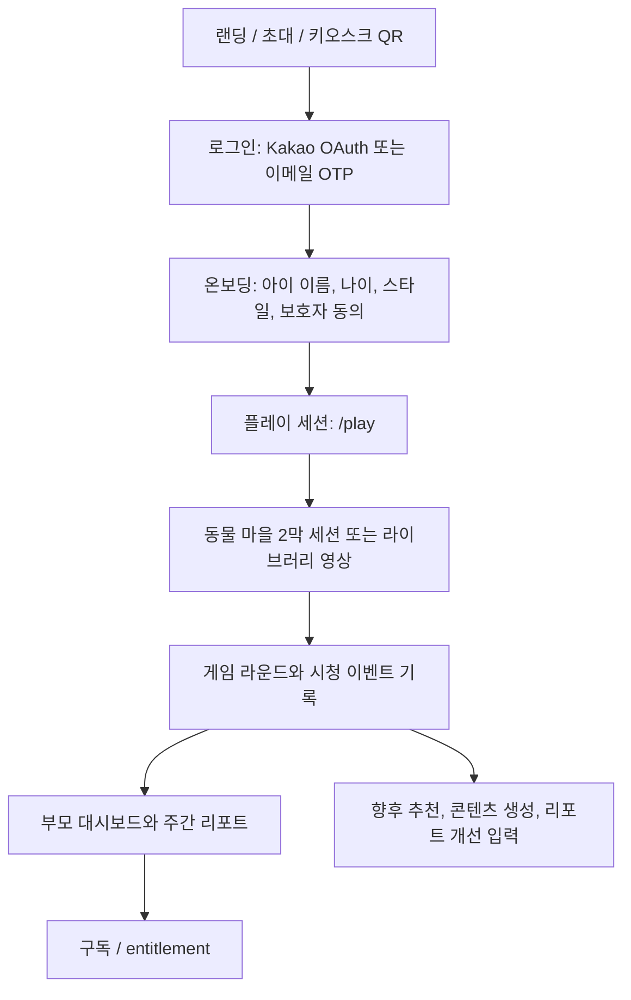
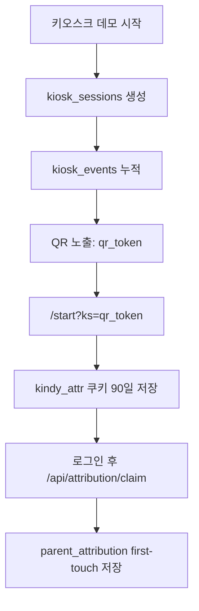

# Kindy 서비스 이해 문서

> 작성일: 2026-06-25  
> 최근 제품 점검: 2026-06-30  
> 목적: 이 문서 하나로 기획자와 개발자가 Kindy의 제품 의도, 핵심 플로우, 코드 구조, 데이터 모델, 운영 리스크를 같은 그림으로 이해한다.  
> 기준: 현재 레포의 실제 코드(`src/`, `supabase/migrations/`, `scripts/`)를 우선한다. 과거 기획 문서는 방향과 배경으로만 참고한다.

## 1. 한 줄 정의

Kindy는 만 3-8세 아이가 이야기 영상과 짧은 놀이를 통해 사고력, 표현력, 문제해결, 자기주도 활동을 경험하고, 부모는 점수나 비교 없이 관찰 가능한 활동 기록과 대화 힌트를 받는 AI 기반 어린이 학습 서비스다.

현재 구현의 중심은 "개별 아이별 실시간 영상 생성"이 아니라, 사전 제작된 라이브러리 영상과 동물 마을 세션을 조합한 공유 콘텐츠 기반 플레이 루프다. 아이가 세션을 진행하면 라운드 이벤트가 쌓이고, 이 데이터는 부모 리포트와 향후 개인화 추천, 생성 파이프라인의 입력이 된다.

2026-06-29 제품 점검 기준으로 고객 화면에서는 내부 운영 설명을 노출하지 않는다. 현장 설치형 짧은 체험, 집에서 바로 시작하는 웹 플레이, 보호자 기록 화면은 퍼널상 이어질 수 있지만, 랜딩이나 플레이 화면에서 "분리되어 작동한다"는 식으로 설명하지 않는다. 고객에게는 "모리와 한 편을 놀면 오늘 기록이 남는다"는 한 흐름으로 보이게 한다.

## 2. 문서 상태 구분

이 레포에는 여러 시기의 문서와 코드가 함께 있다. 따라서 아래 상태 태그로 구분한다.

| 태그 | 의미 |
|---|---|
| 구현됨 | 현재 코드에서 동작 경로가 존재한다. |
| 부분 구현 | UI, API, 데이터 모델 중 일부만 연결되어 있다. |
| 설계됨 | 문서/스키마/스크립트는 있으나 제품 경로에 완전히 붙지 않았다. |
| 운영 필요 | 코드 외부의 설정, 승인, 콘텐츠 적재, 법무 검토가 필요하다. |
| 오래됨 | 과거 결정이나 경로가 현재 코드와 충돌한다. |

중요한 충돌:

| 항목 | 과거 문서 | 현재 코드 기준 |
|---|---|---|
| 레포 위치 | `docs/00_HANDOFF.md`는 `kindy-web`이 문서 모음이라고 설명 | 현재 레포에 Next.js 앱 코드가 존재한다. 이 레포를 실제 웹앱으로 본다. |
| 결제 | Cafe24 또는 수동 결제링크 언급 | TossPayments v2 빌링 기반 월 구독 코드가 있다. |
| 제품 모델 | 아이별 영상 생성권 중심 | 기본 UX는 공유 라이브러리 + 동물 마을 플레이 세션. 개인 영상 생성권/생성 파이프라인은 레거시 또는 운영 도구 성격이 남아 있다. |
| 디자인 | `DESIGN.md`는 크림+세이지 R3를 정본으로 지정 | 많은 화면이 아직 violet 계열 UI를 사용한다. |

## 3. 제품 포지셔닝

### 대상 사용자

| 사용자 | 니즈 | 서비스가 주는 가치 |
|---|---|---|
| 아이 | 재미있는 이야기, 짧고 명확한 상호작용, 즉각적인 칭찬 | 영상, 표정 읽기, 짝 맞추기, 숨은 친구 찾기, 꾸미기 등의 세션 경험 |
| 부모 | 아이가 무엇에 몰입하는지 알고 싶음, 과한 점수/비교는 피하고 싶음 | 활동 횟수, 다시 도전, 표현 활동, 대화 스타터, 주간 리포트 |
| 운영자/콘텐츠팀 | 안전한 콘텐츠 풀을 만들고 공개 여부를 통제해야 함 | `library_videos.published` 기반 공개, AI 영상 생성 스크립트와 seed 도구 |
| 개발팀 | 인증, 결제, 이벤트, 콘텐츠, 게임 루프를 안정적으로 연결해야 함 | Next.js + Supabase + Inngest + Toss 기반 구조 |

### 부모에게 말하는 가치

- 정답 암기보다 질문하고 표현하는 힘을 키운다.
- 매주 이야기와 놀이를 통해 사고력, 문해력, 표현력을 경험한다.
- 부모 리포트는 점수, 등급, 또래 비교가 아니라 관찰 가능한 활동 기록이다.
- 아이 화면에는 광고, 결제 압박, 부모용 데이터 용어를 노출하지 않는다.

### 아이에게 주는 경험

- "동물 마을" 세계에 들어가 친구들의 마음 사건을 보고 돕는다.
- 한 세션은 보통 2막 구조다.
- 1막은 마음 이야기: 친구의 감정과 상황을 알아차린다.
- 2막은 나만의 방법: 짝 맞추기, 패턴, 꾸미기 등으로 친구를 도울 방법을 만든다.
- 라운드 완료 시 별, 스티커, 컬렉션 보상을 받는다.

## 4. 핵심 서비스 루프



### 기본 사용자 흐름

1. 사용자가 `/`, `/start?ks=<qr_token>`, 또는 `/start?from=ai-diagnosis`에서 유입된다.
2. `/auth/login`에서 Kakao OAuth 또는 이메일 OTP로 부모 계정에 로그인한다.
3. `/onboarding`에서 아이 프로필을 만든다.
4. 아이는 `/play?childId=...`로 이동해 오늘의 세션을 시작한다.
5. `/play`는 기본적으로 `animal-village` 세계의 첫 세션인 "사라진 반짝 씨앗"을 계획한다.
6. 세션 중 `game_started`, `game_round_completed`, `collection_progress`, `game_completed` 이벤트가 `/api/game/events`로 전달된다. 학습 기록은 `game_round_completed`와 `game_completed`를 기준으로 저장하고, `collection_progress`는 라운드 row를 만들지 않는 보상 상태 신호로만 수락한다.
7. 부모는 기본 네비게이션에서 `/dashboard`, `/dashboard/report`, `/library`, `/dashboard/settings`를 오가며 진행 상황을 확인한다. `/dashboard/study`는 부분 구현 영역이라 출시 기본 탭에서는 노출하지 않는다.
8. 구독은 `/subscribe`에서 카드 등록과 첫 달 결제로 활성화된다.

## 5. 핵심 화면과 라우트

| 라우트 | 사용자 | 상태 | 역할 | 주요 파일 |
|---|---|---|---|---|
| `/` | 비로그인 부모 | 구현됨 | 서비스 랜딩, 무료 시작 CTA, 초대 코드 입력 | `src/app/page.tsx` |
| `/start` | 키오스크/QR/공개 데모 유입 | 구현됨 | `ks` 토큰 쿠키 저장, 로그인 부모 attribution claim, 공개 데모 source 쿠키 저장 | `src/app/start/page.tsx` |
| `/auth/login` | 부모 | 구현됨 | Kakao OAuth, 이메일 OTP 로그인 | `src/app/auth/login/page.tsx` |
| `/auth/callback` | 부모 | 구현됨 | Supabase OAuth callback 처리 | `src/app/auth/callback/route.ts` |
| `/onboarding` | 부모+아이 | 구현됨 | 아이 이름, 나이, 스타일, 법정대리인 동의 | `src/app/onboarding/page.tsx` |
| `/dashboard` | 부모 | 구현됨 | 아이 홈, 오늘 세션 CTA, 리포트/이야기 진행 | `src/app/dashboard/page.tsx` |
| `/play` | 아이 | 구현됨 | 동물 마을 또는 엔진 기반 플레이 세션 | `src/app/play/page.tsx`, `src/components/game/SessionShell.tsx` |
| `/library` | 부모+아이 | 구현됨 | 게시된 이야기 영상 목록. 고객 화면에서는 "이야기 숲"으로 표현 | `src/app/library/page.tsx` |
| `/library/[id]` | 부모+아이 | 구현됨 | 이야기 영상 재생, 시청 이벤트, 영상 후 단서 질문 | `src/app/library/[id]/page.tsx` |
| `/dashboard/report` | 부모 | 구현됨 | `game_rounds` 기반 주간 미래역량 리포트. 점수/비교 없이 활동 기록과 대화 힌트 표시 | `src/app/dashboard/report/page.tsx` |
| `/dashboard/settings` | 부모 | 구현됨 | 아이 관리, 구독/결제 내역 | `src/app/dashboard/settings/page.tsx` |
| `/dashboard/study` | 부모+아이 | 부분 구현 | syllabus 기반 커리큘럼 등록/진도 | `src/app/dashboard/study/page.tsx` |
| `/dashboard/study/[syllabusId]` | 부모+아이 | 부분 구현 | 단원/차시 진도표 | `src/app/dashboard/study/[syllabusId]/page.tsx` |
| `/dashboard/study/lesson/[lessonId]` | 아이 | 부분 구현 | 차시 플레이어와 진도 업데이트 | `src/app/dashboard/study/lesson/[lessonId]/page.tsx` |
| `/subscribe` | 부모 | 구현됨 | Toss 카드 등록, 구독 상태, 해지 | `src/app/subscribe/page.tsx` |
| `/subscribe/success` | 부모 | 구현됨 | 빌링키 발급, 첫 달 결제, entitlement 동기화 | `src/app/subscribe/success/page.tsx` |
| `/subscribe/fail` | 부모 | 구현됨 | Toss 카드 등록 실패 처리 | `src/app/subscribe/fail/page.tsx` |
| `/legal/*` | 부모 | 구현됨 | 약관, 개인정보, 사업자 정보 | `src/app/legal/*` |
| `/demo/*` | 내부/영업 | 구현됨 | 키오스크 짧은 체험과 현재 고객 화면 프리뷰. legacy demo route는 현재 웹 흐름으로 redirect | `src/app/demo/*` |
| `/demo/ai-diagnosis` | 부모+아이 | 구현됨 | AI 이야기 영상 1편 시청 후 C6 생각 씨앗을 짧게 진단하고 본 서비스 시작 CTA로 연결 | `src/app/demo/ai-diagnosis/*` |

## 6. 플레이 세션 구조

### 기본 세션: 동물 마을

현재 `/play`의 기본 세계는 `animal-village`다. `?world=engine`을 넘기면 레거시 엔진 기반 세션으로 전환된다.

| 요소 | 설명 | 파일 |
|---|---|---|
| 세계 | 동물 마을, 별빛 축제, 친구들의 마음 사건 | `src/data/worlds/animal-village.ts` |
| 첫 세션 | "사라진 반짝 씨앗" | `KKUMI_DAY_SESSION` |
| 친구 | 모리, 꾸미, 방울, 나옹, 도토, 올빼미 | `CHARACTERS` |
| 첫 영상 | "모리와 사라진 반짝 씨앗" 75초 영상 플랜. 장면 단서, 친구 마음, 다음 놀이 예고를 담는다 | `firstVideo` |
| 1막 | 사라진 씨앗 단서, 꾸미 얼굴 단서, 풀숲 단서 찾기 | `act1` |
| 2막 | 친구 선물 단서, 별빛 길 무늬, 씨앗 선물 꾸미기 | `act2` |
| 음성 | Gemini TTS 음성 ID와 라인 ID를 안정적으로 관리 | `collectVoiceLines()` |

### 세션 상태 머신

`SessionShell`은 다음 stage를 가진다.

| stage | 의미 |
|---|---|
| `intro` | 오늘의 이야기 도입 카드 |
| `video` | 해당 막의 영상 재생. 영상이 없으면 카드/라운드로 폴백 |
| `transition` | 막 전환 카드 |
| `round` | 실제 게임 라운드 |
| `gate` | 라운드 완료 후 보상 요약과 다음 단계 버튼 |
| `complete` | 세션 완료, 획득물 요약, 부모 대화 스타터 |

### 게임 타입

| 게임 타입 | 용도 | 상태 |
|---|---|---|
| `G1_match` | 짝 맞추기 | 구현됨 |
| `G2_sort` | 분류/무리 나누기 | 구현됨 |
| `Q_quiz` | 영상 후 단서 질문. 내부 타입명만 quiz를 유지 | 구현됨 |
| `emotion_expression` | 표정/마음 표현 | 구현됨 |
| `hidden_friend` | 숨은 친구 찾기 | 동물 마을 전용 |
| `decorate` | 선물 꾸미기 | 동물 마을 전용 |
| `G3_sequence`, `G4_listen`, `G5_find` | 엔진 타입으로 정의됨 | 부분 구현 또는 확장용 |

### 난이도와 라운드 계획

- `planSession()`은 토픽에 따라 staged 세션 또는 레거시 세션을 만든다.
- `future_skills`, `sel_emotion`, `creativity` 등은 통합 미래역량 트랙으로 간주된다.
- staged 세션은 `emotion` phase와 `creativity` phase로 나뉜다.
- 라운드 완료 결과의 정확도, 재시도 여부, latency를 보고 `nextDifficulty()`가 난이도를 조정한다.
- `dashboard/report`는 라운드의 `objective_code`, `game_type`, `reward_payload`를 C6 창의 지도(관찰, 상상·유추, 패턴, 변형·도형, 색·균형, 통합·콜라주)로 다시 묶는다.
- `/dashboard` 요약 API는 C6 6칸 전체, 가장 잘 들어온 놀이, 다음에 채울 씨앗, 3일 보완 플랜을 내려준다.
- C6 지도는 점수나 진단 등급이 아니라 "해본 놀이 수"와 "다음에 채울 씨앗"만 보여준다.

## 7. 콘텐츠와 커리큘럼

### 콘텐츠 계층

| 계층 | 설명 | 데이터/파일 |
|---|---|---|
| World | 동물 마을 세계, 캐릭터, 활동 템플릿 | `src/data/worlds/animal-village.ts` |
| Library Video | 운영자가 등록하고 `published=true`로 공개하는 영상 카탈로그 | `library_videos` |
| Syllabus | 과목/연령 기반 커리큘럼 척추 | `syllabuses`, `syllabus_units`, `syllabus_lessons` |
| Lesson Progress | 아이별 차시 상태 | `lesson_progress` |
| Game Session | 실제 플레이 세션 | `game_sessions`, `game_rounds` |

### 현재 노출 언어

부모 화면에서는 "정서/창의" 같은 추상 교육 용어보다 다음 표현을 사용한다.

- 생각하는 힘
- 사고력
- 표현력
- 문제해결
- 자기주도
- 끈기
- 호기심
- 소통

### 리포트 가드레일

부모 리포트의 핵심 규칙은 `src/lib/game/sel-report.ts`에 명시되어 있다.

- 관찰 가능한 활동 횟수만 집계한다.
- 점수, 등급, 레벨, 백분위, 또래 비교를 금지한다.
- 아이의 내면 상태나 능력을 단정하지 않는다.
- 취향 프로파일은 빈도 패턴으로만 표현한다.

## 8. 데이터 모델

최신 기준은 `supabase/schema.sql`이 아니라 `supabase/migrations/*.sql`이다.

### 사용자와 아이

| 테이블 | 역할 | 주요 컬럼 |
|---|---|---|
| `children` | 아이 프로필 | `parent_id`, `name`, `age`, `styles`, `topics` |
| `parent_consents` | 보호자 동의 기록 | `parent_id`, nullable `child_id`, 동의 범위, 약관/개인정보/아동 동의 버전, 동의 시각 |
| `word_profiles` | GACS-3 개인화 프로필 | `preferred_adjectives`, `avoid_adjectives`, `weights` |

`parent_id`는 Supabase `auth.uid()`를 문자열로 저장한다. `parent_consents.child_id`는 아이 삭제 시 `null`로 바뀌며, 동의 증적은 아이 프로필/활동 기록과 분리해 보호자 계정 기준으로 남긴다.

### 영상과 반응

| 테이블 | 역할 | 주요 컬럼 |
|---|---|---|
| `videos` | 아이별 생성 영상 또는 legacy 영상 | `child_id`, `status`, `phase`, `script`, `cost_ledger`, `video_path` |
| `library_videos` | 사전 제작 공유 영상 | `topic`, `age_band`, `style_tags`, `published`, `script`, `subtitles_url`, `scenes` |
| `view_events` | 시청 이벤트 | `video_id` 또는 `library_video_id`, `child_id`, `event_type`, `timestamp_sec` |
| `emoji_reactions` | 영상 후 감정 리액션 | `reaction` |
| `quiz_results` | legacy 영상 후 단서 질문 결과 | `question`, `selected_answer`, `is_correct` |

`view_events`는 0011 migration 이후 `video_id`와 `library_video_id` 중 정확히 하나만 갖도록 확장되었다.

### 게임 루프

| 테이블 | 역할 | 주요 컬럼 |
|---|---|---|
| `game_sessions` | 인증된 가정/키오스크 플레이 세션 | `child_id`, `context`, `rounds_total`, `rounds_completed`, `completed_at` |
| `game_rounds` | 라운드별 결과와 보상 | `game_type`, `difficulty`, `objective_code`, `score`, `retried`, `reward_payload` |

`collection_progress`는 아이 화면의 보상/컬렉션 상태 신호다. 라운드별 보상 변화는 이미 `game_round_completed.reward_payload`로 저장되므로, `collection_progress` 자체는 `game_rounds`에 별도 row를 만들지 않는다.

### 커리큘럼

| 테이블 | 역할 |
|---|---|
| `syllabuses` | 과목/연령별 커리큘럼 묶음 |
| `syllabus_units` | 단원 |
| `syllabus_lessons` | 차시. `library_video_id=null`이면 콘텐츠 준비 중 |
| `syllabus_enrollments` | 아이별 수강 등록 |
| `lesson_progress` | 아이별 차시 진도 |

### 결제와 권한

| 테이블 | 역할 |
|---|---|
| `billing_keys` | Toss 빌링키 저장 |
| `subscriptions` | 구독 상태, 결제 기간 |
| `entitlements` | 앱과 웹이 읽어야 하는 premium 권한 단일 진실 |
| `purchases` | 결제 내역. 구독 결제도 기록 |
| `credits` | legacy 영상 생성권 잔고 |

보안 TODO: `billing_keys.billing_key`는 실서비스에서 평문 저장 금지다. migration에도 Vault 또는 앱 레벨 암호화 TODO가 명시되어 있다.

### 키오스크와 초대

| 테이블 | 역할 |
|---|---|
| `kiosk_sessions` | 익명 키오스크 사용 세션, QR 토큰 발급 |
| `kiosk_events` | 익명 행동 이벤트 |
| `parent_attribution` | 키오스크 QR 유입과 부모 계정 연결 |
| `waitlist` | 대기자 이메일 |
| `invite_codes` | 초대 코드 |
| `invite_redemptions` | 부모별 초대 코드 사용 기록 |

## 9. API 구조

### 인증과 프로필

| API | Method | 역할 |
|---|---|---|
| `/api/children` | GET, POST | 아이 목록/쿼리 기반 단건 조회, 아이 생성. POST는 `parent_consent=true`가 필요하다 |
| `/api/children/[id]` | GET, PATCH, DELETE | 아이 조회/수정/삭제. 삭제 시 아이 프로필과 연결 활동 기록은 사라지고, 멤버십·결제·필수 동의 기록은 보호자 계정 기준으로 관리됨 |
| `/api/invite/redeem` | GET, POST | 초대 코드 사용 여부, 초대 코드 등록 |
| `/api/waitlist` | POST | 대기자 등록 |

### 콘텐츠와 플레이

| API | Method | 역할 |
|---|---|---|
| `/api/library` | GET | 게시된 라이브러리 영상 목록 |
| `/api/library/[id]` | GET | 라이브러리 영상 단건 |
| `/api/library/[id]/view` | POST | 라이브러리 영상 play/complete 이벤트 |
| `/api/game/events` | POST | 게임 세션과 라운드 이벤트 적재 |
| `/api/events` | POST, PUT | legacy 아이별 영상 시청 이벤트 |
| `/api/reactions` | POST | legacy 아이별 영상 이모지 반응 |
| `/api/quiz` | POST | legacy 아이별 영상 단서 질문 결과 |
| `/api/attention-quiz` | POST | Claude로 영상 후 장면 단서 질문 생성 |

### 커리큘럼

| API | Method | 역할 |
|---|---|---|
| `/api/syllabus` | GET | 공개 syllabus 목록 |
| `/api/syllabus/[id]` | GET | syllabus 상세 + 아이별 진도 |
| `/api/syllabus/enroll` | POST | 아이를 syllabus에 등록하고 첫 차시 unlock |
| `/api/syllabus/progress` | POST | 차시 시청/단서 질문/완료 처리 |

### 결제와 권한

| API | Method | 역할 |
|---|---|---|
| `/api/subscription` | GET | 최신 구독과 entitlement 조회 |
| `/api/subscription/cancel` | POST | 기간말 해지 |
| `/api/payments/toss/billing-key` | POST | authKey로 빌링키 발급, 첫 달 결제, 구독 활성화 |
| `/api/payments/webhook/toss` | POST | Toss 결제 webhook 검증과 구독 상태 동기화 |
| `/api/credits` | GET | legacy 개인 영상 생성권 잔고. 고객 화면에서는 노출하지 않음 |
| `/api/purchases` | GET | 결제 내역 |

### 키오스크

| API | Method | 역할 |
|---|---|---|
| `/api/kiosk/events` | OPTIONS, POST | 익명 키오스크 이벤트 인제스트 |
| `/api/attribution/claim` | POST | QR 토큰을 로그인 부모 계정과 연결 |

## 10. 인증과 보안

### 인증 방식

- 웹 브라우저: Supabase 세션 쿠키.
- 쿠키 없는 클라이언트: `Authorization: Bearer <supabase access token>`을 `requireAuth(request)`가 허용한다.
- 로그인 방식: Kakao OAuth, 이메일 OTP.

### 서버 클라이언트 분리

| 파일 | 용도 |
|---|---|
| `src/lib/supabase.ts` | service-role 서버 전용. RLS를 우회한다. 클라이언트 import 금지 |
| `src/lib/supabase-server.ts` | Server Component/API의 쿠키 기반 Supabase anon client |
| `src/lib/supabase-browser.ts` | 브라우저 client |

### 보호 방식

- `src/proxy.ts`가 `/dashboard`, `/play`, `/library`, 일부 API 경로를 인증 보호한다.
- 대부분의 API는 다시 `getCurrentParentId()`와 child ownership 검사를 수행한다.
- RLS는 migrations에서 활성화되어 있으며, user-scoped 테이블은 `children.parent_id = auth.uid()::text` 기반으로 제한된다.
- 카탈로그성 콘텐츠(`library_videos`, `syllabuses`)는 인증 부모에게 published row만 읽히도록 설계되어 있다.

## 11. 결제와 구독

현재 코드 기준 유료 모델은 월 25,000원 Kindy 멤버십이다.

### 결제 흐름

1. 부모가 `/subscribe`에 진입한다.
2. TossPayments SDK가 카드 빌링 인증창을 연다.
3. 성공 시 `/subscribe/success?authKey=...&customerKey=...`로 돌아온다.
4. `/api/payments/toss/billing-key`가 다음 일을 처리한다.
   - `authKey`로 Toss 빌링키 발급
   - `billing_keys` 저장
   - 첫 달 즉시 결제
   - `purchases` paid 기록
   - `subscriptions` active 생성 또는 갱신
   - `sync_entitlement(parent_id)` 호출
5. `/api/subscription`은 현재 구독과 entitlement를 반환한다.

### 해지 흐름

- `/api/subscription/cancel`은 `status='canceled'`, `canceled_at=now()`로 바꾼다.
- 현재 결제 기간이 끝날 때까지 `entitlements.is_premium=true`가 유지된다.
- `/api/subscription`과 `/api/subscription/cancel`은 고객 응답에 DB/Supabase 원문 오류나 `Unauthorized` 같은 내부 문구를 노출하지 않는다. 원문은 서버 로그의 `[subscription:*]`, `[subscription-cancel:*]` 태그로만 추적한다.

### 현재 확인할 점

- 구독/entitlement 데이터 모델과 UI는 구현되어 있다.
- `/play`와 `/api/library`는 월 구독 entitlement 또는 무료 홈 플레이 3세션 잔여분을 확인한다.
- 무료 3세션을 모두 마친 비구독 부모는 아이 플레이 반복 대신 보호자 기록과 `/subscribe` 전환 화면으로 안내된다.
- 설정 화면은 구독/이용권 언어와 결제 내역 중심으로 정리되어 있다. legacy 생성권 API는 운영 호환용으로만 남긴다.

## 12. AI 영상 생성 파이프라인

현재 제품 기본 경로는 공유 라이브러리지만, 아이별 또는 운영용 영상 생성 파이프라인도 코드에 남아 있다.

### AI 영상 진단 데모

`/demo/ai-diagnosis`는 가입 전 공개 퍼널이다. AI로 만든 모리 이야기 영상을 보여주고, 브라우저 안에서만 3개 단서 선택을 받아 C6 생각도구의 오늘 신호와 다음에 채울 씨앗을 보여준다. 이 결과는 평가나 능력 단정이 아니라 정식 서비스에서 어떤 영상/놀이를 이어볼지 제안하는 첫 단서로만 표현한다.

데모 원칙:

- 인증, DB 저장, 결제 버튼 없이 체험한다.
- 아이에게는 한 번에 하나의 큰 선택지를 보여준다.
- 부모에게는 `오늘 잘 보인 씨앗`, `다음에 채울 씨앗`, `무료 3편으로 채우기` CTA를 보여준다.
- CTA는 `/start?from=ai-diagnosis`로 이동하며, `/start`는 `kindy_source=ai-diagnosis` 쿠키를 30일 저장하고 진단 다음 문구를 보여준다.
- 부족한 영역은 낙인처럼 말하지 않고 "짧은 체험에서 아직 덜 관찰된 도구"로 다룬다.

### 15-30초 pipeline

파일: `src/lib/video-pipeline.ts`, `src/inngest/functions/video-generation.ts`

단계:

1. Claude director가 `VideoScript` JSON을 만든다.
2. Nano Banana가 캐릭터 레퍼런스 시트를 만든다.
3. Nano Banana가 씬 키프레임을 만든다.
4. Seedance 2.0이 15초 영상 클립을 만든다.
5. 30초 이상이면 extension을 체이닝한다.
6. ffmpeg로 normalize/concat한다.
7. Supabase Storage에 업로드하고 signed URL을 만든다.
8. `videos` row에 phase, progress, cost ledger를 기록한다.

### 90초 episode pipeline

파일: `src/lib/episode-pipeline.ts`

특징:

- Claude가 4-7 scene, 총 85-95초 episode script를 생성한다.
- narration scene과 character speaking scene을 섞는다.
- Gemini TTS와 fal lipsync, Seedance silent video를 조합한다.
- scene metadata, subtitles, thumbnail, final video storage path를 만든다.

### 운영상 중요한 전제

- 생성물은 아동에게 바로 노출하지 않고 `library_videos.published=false`로 적재한 뒤 검수 후 공개하는 것이 안전한 운영 원칙이다.
- 현재 레포에서 별도 admin approval UI는 명확히 확인되지 않는다. 운영 절차나 백오피스가 필요하다.
- Cloud Run runtime에는 ffmpeg가 포함되어야 한다. Dockerfile은 `ffmpeg`, `ffprobe`를 설치한다.

## 13. 키오스크 퍼널

키오스크는 "익명 체험 -> QR -> 가정 가입"을 측정하는 별도 퍼널이다.



개인정보 원칙:

- 키오스크 구간은 식별정보를 수집하지 않는다.
- 세션 토큰, 선택값, 행동 이벤트만 저장한다.
- 인증 부모와의 연결은 QR 토큰으로 로그인 후 명시적으로 claim한다.
- `kindy_source`는 QR 토큰과 별개의 공개 데모 유입 source 쿠키다. 현재는 DB claim 없이 `/start` 문구와 향후 마케팅 분석 연결을 위한 브라우저 신호로만 쓴다.

## 14. 운영과 배포

### 기술 스택

| 영역 | 기술 |
|---|---|
| 웹 | Next.js 16, React 19, TypeScript |
| 스타일 | Tailwind CSS 4, Pretendard |
| 인증/DB/Storage | Supabase |
| 비동기 작업 | Inngest |
| 결제 | TossPayments v2 billing |
| AI | Anthropic Claude, Google Gemini/Nano Banana, fal.ai, Seedance |
| 배포 | GCP Cloud Run, Cloud Build, Docker |

### 주요 환경변수

| 변수 | 용도 |
|---|---|
| `NEXT_PUBLIC_SUPABASE_URL` | Supabase URL |
| `NEXT_PUBLIC_SUPABASE_ANON_KEY` | Supabase anon key |
| `SUPABASE_SERVICE_ROLE_KEY` | 서버 전용 service-role key |
| `NEXT_PUBLIC_SITE_URL` | OAuth callback 기준 URL |
| `ANTHROPIC_API_KEY`, `CLAUDE_MODEL` | Claude director와 attention quiz |
| `GOOGLE_API_KEY`, `GEMINI_API_KEY` | 이미지/TTS |
| `FAL_KEY`, `SEEDANCE_TIER` | 영상 생성 |
| `INNGEST_SIGNING_KEY`, `INNGEST_EVENT_KEY`, `INNGEST_DEV` | Inngest |
| `NEXT_PUBLIC_TOSS_CLIENT_KEY`, `TOSS_SECRET_KEY` | TossPayments |
| `NEXT_PUBLIC_BIZ_*` | 전자상거래 표시 정보 |

### 로컬 실행

```bash
npm install
npm run dev
```

Inngest 로컬 개발:

```bash
npx inngest-cli@latest dev -u http://localhost:3000/api/inngest
```

주의: 실제 영상 생성, 결제, 외부 AI 호출은 API key와 네트워크가 필요하다.

### 빌드와 배포

```bash
npm run build
```

Cloud Build:

```bash
gcloud builds submit --config=cloudbuild.yaml --substitutions=_SUPABASE_URL=..., _SUPABASE_ANON_KEY=..., _TAG=latest
```

Dockerfile은 Next standalone build를 사용하며 Cloud Run runtime에 ffmpeg를 포함한다.

## 15. 법무/컴플라이언스 가드레일

### 아동 데이터

- 14세 미만 아동 데이터 수집을 전제로 부모 동의 UI가 있다.
- 별도 SMS/PASS 본인확인은 현재 온보딩에서 구현되어 있지 않다. 결제 또는 외부 인증 단계와의 연결 여부를 운영에서 결정해야 한다.
- 웹은 카메라 기반 주의 측정을 사용하지 않는다. 완주, 재시청, 응답, 라운드 결과 같은 행동 신호를 사용한다.
- 온보딩은 보호자 동의 없이 아이 활동 기록 저장으로 넘어가지 않는다. 아이 추가 모드도 같은 동의 단계를 거치며, `/api/children` POST도 `parent_consent=true` 없이는 거절한다. Supabase 환경에서는 `parent_consents`에 동의 시각, 동의 범위, 약관/개인정보/아동 동의 버전을 남긴다. 로그인/세션 확인이 지연될 때도 무한 로딩 대신 로그인 화면으로 복구되어야 한다.
- 아이 이름표 삭제는 아이 프로필, 놀이 기록, 영상 시청 기록, 학습 진도를 지우는 보호자 설정 기능이다. `parent_consents`는 `child_id`를 `null`로 두고 보호자 계정 기준 증적으로 남기며, 멤버십·결제 내역도 아이 삭제와 분리한다.
- `src/content/legal/privacy.md`는 보호자 동의 기록의 수집 항목, 이용 목적, 보유 기간, 아이 삭제 시 분리 보관 가능성을 설명한다. 약관/개인정보 처리방침 문구가 바뀌면 `src/app/api/children/route.ts`의 동의 버전 상수도 같이 갱신한다.
- 아이 화면의 버튼과 선택지는 작은 아이가 누르기 쉬운 크기로 유지한다. WCAG 2.2 Target Size 기준(최소 24x24 CSS px)을 하한으로 보고, 실제 핵심 CTA는 44px 이상을 기본값으로 둔다.

참고 기준:

- FTC COPPA FAQ: 아동 온라인 서비스의 보호자 고지, 동의, 데이터 관리 원칙 확인용. <https://www.ftc.gov/business-guidance/resources/complying-coppa-frequently-asked-questions>
- W3C WCAG 2.2 Target Size Minimum: 터치 타깃 하한 기준 확인용. <https://www.w3.org/WAI/WCAG22/Understanding/target-size-minimum.html>

### 마케팅/리포트 표현

금지:

- 점수, 등급, 백분위, 또래 비교
- "창의력이 향상됐다" 같은 검증되지 않은 효능 단정
- "공식", "인증", "감수" 등 제휴를 암시하는 표현
- 불안, 죄책감, 놓치면 뒤처진다는 압박

허용:

- 관찰 가능한 활동 횟수
- 강점 기반 성장 서사
- "자주 고른 것", "이번 주 스스로 한 활동" 같은 빈도 기반 설명
- 책/교수 커리큘럼은 "영감/참고/기반" 수준으로 사실 표현

## 16. 현재 리스크와 남은 일

### 제품/기획

| 항목 | 상태 | 다음 액션 |
|---|---|---|
| 핵심 포지셔닝 | 구현됨 | 실제 사용자 테스트 후 첫 화면 CTA와 무료 체험 문구를 계속 조정 |
| 동물 마을 세션 | 구현됨 | 영상/아트 asset을 실제 IP로 교체 |
| 부모 리포트 | 구현됨 | `game_rounds` 기반 리포트의 실제 데이터 품질과 빈 상태 UX 개선 |
| 커리큘럼 study | 부분 구현 | seed 데이터, lesson 영상 매핑, 실제 사용 경로 검증 |
| 구독 권한 gate | 구현됨 | 무료 3세션 이후 `/play`, `/api/library`, `/api/library/[id]`, `/api/library/[id]/view`가 entitlement를 확인한다. 운영 전 정책 수치는 사용자 테스트 후 조정 |
| legacy 생성권 모델 | 오래됨/legacy | 고객 화면은 라이브러리/구독 흐름으로 redirect한다. `/api/videos`, `/api/credits`는 운영 호환용으로 보존하되 DB 원문·영문 내부 오류를 고객 응답에 노출하지 않는다. |

### 기술

| 항목 | 상태 | 다음 액션 |
|---|---|---|
| Supabase schema source | migrations가 최신 | `supabase/schema.sql`은 outdated로 표시하거나 재생성 |
| Billing key 보안 | TODO | 실서비스 전 Vault/암호화 적용 |
| Admin approval | 설계됨 | `library_videos.published` 운영 UI 또는 스크립트 필요 |
| Inngest production | 운영 필요 | signing/event key, Cloud Run env, webhook 확인 |
| Docs drift | 존재 | 오래된 Cafe24/다른 레포 경로 문서에 주석 또는 링크 정리 |
| 디자인 R3 적용 | 진행 중 | 고객 핵심 화면은 크림+세이지 토큰으로 맞추고, 남은 운영/legacy 화면만 점진 정리 |

### 운영

| 항목 | 필요 작업 |
|---|---|
| 콘텐츠 풀 | `library_videos`에 published 영상과 script, subtitles를 안정적으로 적재 |
| 법무 | 약관, 개인정보, 아동 데이터, 환불, IP 표현 검토 |
| 결제 | Toss live key 전환, webhook 운영 검증, 사업자 표시 정보 입력 |
| 도메인 | `kindy.kr` DNS/SSL/Cloud Run 연결 상태 확인 |
| 키오스크 | 설치처 location whitelist와 QR 전환 측정 검증 |

## 17. 개발자가 처음 볼 파일

| 알고 싶은 것 | 먼저 볼 파일 |
|---|---|
| 앱 전체 라우트 | `src/app/` |
| 랜딩 | `src/app/page.tsx` |
| 온보딩 | `src/app/onboarding/page.tsx` |
| 플레이 세션 | `src/app/play/page.tsx`, `src/components/game/SessionShell.tsx` |
| 동물 마을 콘텐츠 | `src/data/worlds/animal-village.ts` |
| 게임 엔진 | `src/lib/game/engine.ts`, `src/lib/game/village-session.ts` |
| 부모 리포트 | `src/app/dashboard/report/page.tsx`, `src/lib/game/sel-report.ts` |
| 라이브러리 | `src/app/library/*`, `src/app/api/library/*` |
| 결제 | `src/app/subscribe/*`, `src/lib/subscription.ts`, `src/lib/toss.ts` |
| 인증 | `src/lib/auth.ts`, `src/proxy.ts`, `src/lib/supabase-*.ts` |
| DB | `supabase/migrations/` |
| AI pipeline | `src/lib/video-pipeline.ts`, `src/lib/episode-pipeline.ts` |
| 디자인 정본 | `DESIGN.md` |
| 실수 방지 | `docs/LESSONS.md` |

## 18. 기획자가 처음 볼 문서

| 알고 싶은 것 | 문서 |
|---|---|
| 현재 서비스 구조 | 이 문서 |
| 런치 결정 | `docs/03_LAUNCH_FOUNDATION_LOCK.md` |
| 랜딩/광고 카피 | `docs/04_LAUNCH_COPY.md` |
| 법적 리스크 | `docs/05_LEGAL_RISK.md` |
| 부모 리포트 설계 | `부모대시보드_MVP_설계.md` |
| 콘텐츠 작성법 | `docs/content/authoring-guide.md` |
| 동물 마을 시즌 | `docs/content/animal-village-season1.md` |
| 디자인 토큰 | `DESIGN.md` |

## 19. 앞으로의 권장 정리

1. README를 서비스 입구로 바꾸고 이 문서를 링크한다.
2. `docs/00_HANDOFF.md`의 오래된 레포 설명에는 "historical" 표시를 붙인다.
3. `supabase/schema.sql`은 최신 migrations에서 재생성하거나 "참고용/구버전"으로 명시한다.
4. 결제 모델은 구독/이용권 중심으로 유지하고 legacy 생성권 UI/문구는 고객 화면에 다시 나오지 않게 한다. 운영 호환용 legacy API도 고객 응답에서는 현재 서비스 톤의 안내만 반환한다.
5. 부모 리포트는 현재 `game_rounds`를 읽으므로, 다음 단계는 story seed, thinking tool, favorite activity의 실제 품질을 높이는 것이다.
6. entitlement gate는 `/play`, 라이브러리 목록·상세·시청 기록에 적용되어 있다. 다음 단계는 무료 3세션 수치와 전환 카피를 사용자 테스트로 조정하는 것이다.
7. `DESIGN.md` R3 토큰을 남은 운영/legacy 화면에 점진 적용한다.
